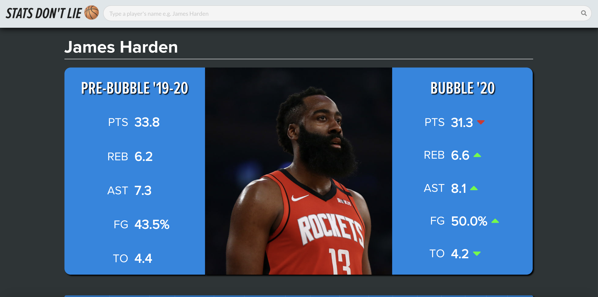

## About
During the 2019 - 2020 season, the NBA was forced to change, due to Covid-19,to protect their players. The NBA eliminated most fan attendance and isolated players during the final eight games of the 2019–20 regular season and throughout the 2020 NBA playoffs. This project aims to compare an NBA player's performance inside and outside the NBA Bubble and observe any statistical changes from playing under these circumstances. We gathered information from games on October 22, 2019 through March 12, 2020 for Pre-Bubble stats and July 30 through October 12, 2020 for stats inside the NBA bubble, using this [api](https://balldontlie.io). Averaging these stats from these different pools, we hope to help fans determine for themselves whether or not the NBA bubble made a difference within a player's performance for an unprecedented year. You can see this project [here](https://statsdontlie.net), which uses React and Semantic UI.

## Available Scripts

In the project directory, you can run:

### `npm start`

Runs the app in the development mode. 
Open [http://localhost:3000](http://localhost:3000) to view it in the browser.

The page will reload if you make edits. 
You will also see any lint errors in the console.

## In Action
Homepage view

Example view

